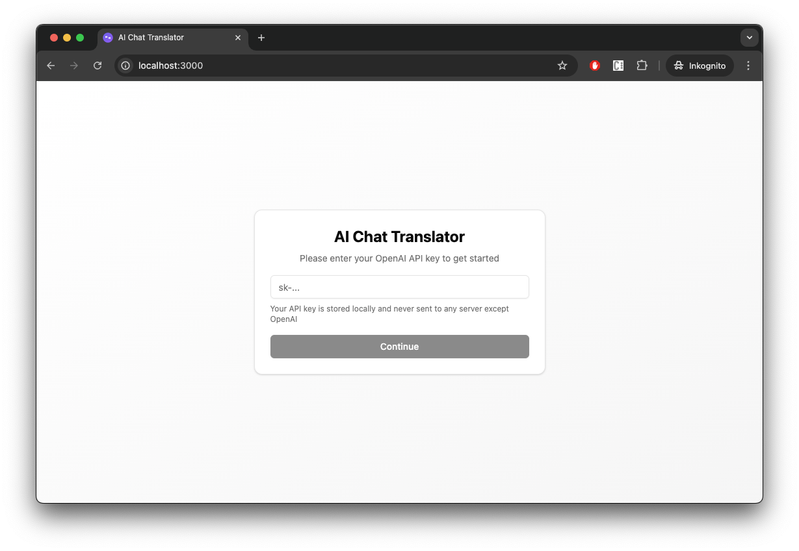

# AI Chat Translator

An AI-powered chat application for language translation built with React, shadcn/ui, and OpenAI API.

## Features

- 🌍 Translate word and sentences. Get exmaples on how to use a word
- 🔄 Bidirectional translation (click on selected pair to reverse direction)
- 💬 Chat-based interface for natural conversation
- 🎨 Modern UI with shadcn/ui components
- 📱 Progressive Web App (PWA)
- 🐳 Docker support for easy deployment

## Prerequisites

- Node.js 18+ and npm
- OpenAI API key
- Docker and Docker Compose (for containerized deployment)

## Setup

There are two ways to use your **OPENAI_API_KEY**:

- Use a .env file or
- Enter the key in the browser (stored on local storage)



### Local Development

1. **Install dependencies:**
   ```bash
   npm install
   ```

2. **Configure environment variables:**
   Copy the example environment file and add your OpenAI API key:
   ```bash
   cp .env.example .env
   ```
   
   Then edit `.env`:
   ```env
   OPENAI_API_KEY=your_openai_api_key_here
   ```

3. **Start the development server:**
   ```bash
   npm run dev
   ```

4. **Access the application:**
   Open your browser and navigate to `http://localhost:3000`

### Building for Production

**For production build:**
```bash
npm run build
```

**For local development build:**
```bash
npm run build:local
```

The built files will be in the `dist` directory.

## Publishing to Docker Hub

1. **Log in to Docker Hub:**

        docker login

2. **Build, tag and push with your Docker Hub username:**

         # Use BuildKit for multi-arch builds
         docker buildx create --use

         docker buildx build \
            --platform linux/amd64,linux/arm64 \
            -t mauricewipf/ai-chat-translator:latest \
            -t mauricewipf/ai-chat-translator:0.1.1 \
            --build-arg GIT_REVISION=$(git rev-parse --short HEAD) \
            --build-arg APP_VERSION=0.1.1 \
            --push \
            --provenance=false \
            .

3. Others can then pull and use your image:

         docker pull mauricewipf/ai-chat-translator:latest

View on Docker Hub: https://hub.docker.com/repository/docker/mauricewipf/ai-chat-translator

4. How to use the image

         docker run \
            --publish 3000:80 \
            --restart unless-stopped \
            --env OPENAI_API_KEY=YOUR_SECRET_KEY_BASE \
            mauricewipf/ai-chat-translator:latest

## Docker Deployment

1. **Set your OpenAI API key:**
   Create a `.env` file in the root directory:
   ```env
   OPENAI_API_KEY=your_openai_api_key_here
   ```

2. **Build and run with Docker Compose:**
   ```bash
   docker-compose up -d --build
   ```

3. **Access the application:**
   Open your browser and navigate to `http://localhost:3000`

## License

MIT

## Support

For issues and questions, please open an issue on the repository.

